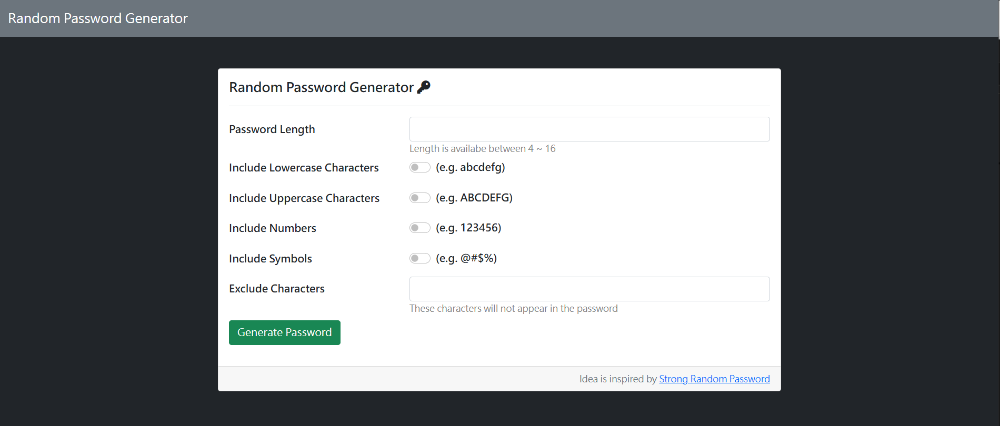
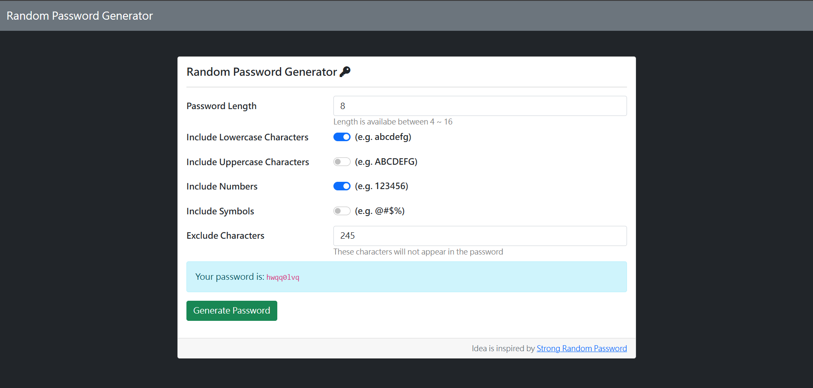

# Random Password Generator

Idea is inspired by Strong Random Password，
此專案產生4~16碼的隨機亂數密碼(包含大小寫英數字、數字及符號)。

## 產品功能
+ 可隨機生成最小4碼，最大16碼的亂數密碼。
+ 密碼字元包含大小寫英數字、數字及符號。
+ 可勾選生成密碼中所包含的字元類別 (例如僅有小寫英文，或僅有數字與符號等)。
+ 可手動輸入欲排除的密碼字元，生成的密碼即不包含輸入字元。
+ 點擊頁首標題「Random Password Generator」可刷新頁面。

## 專案畫面



## 安裝
1. 開啟終端機，輸入 git clone，將專案存到電腦
```
git clone https://github.com/S4chan/password-generator.git
```
2. 移到專案資料夾 password-generator
```
cd password-generator
```
3. 安裝 npm 套件管理器
```
npm install
```
4. 執行 app.js
```
npm run dev
```
5. ```server``` 順利運行後，終端機會顯示網址
```
express server on http://localhost:3000
```
6. 在瀏覽器輸入網址 ```http://localhost:3000``` 即可瀏覽專案

## 開發工具
+ Visual Studio Code - 程式編輯器
+ Nodejs - 執行環境
+ express - 後端框架
+ express-handlebars - 樣板引擎
+ nodemon - 輔助工具
+ font awesome - 圖示庫

## 製作者
[S4chan](https://github.com/S4chan)
